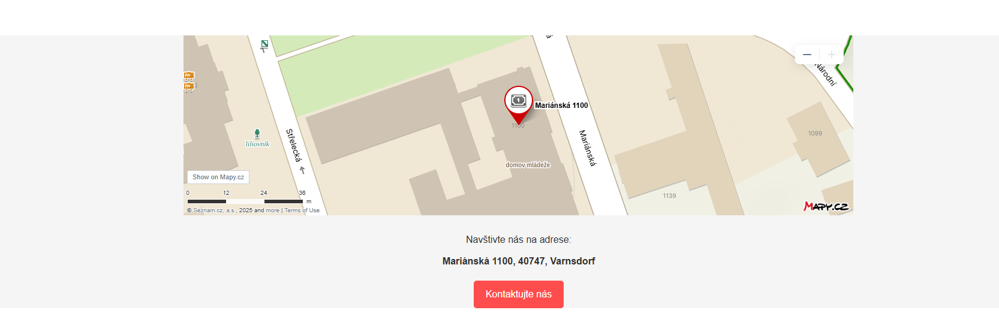
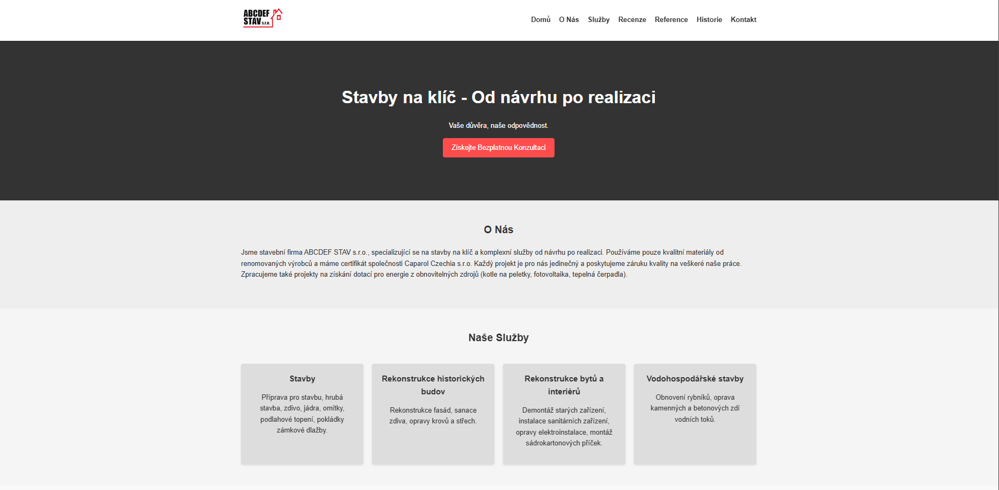
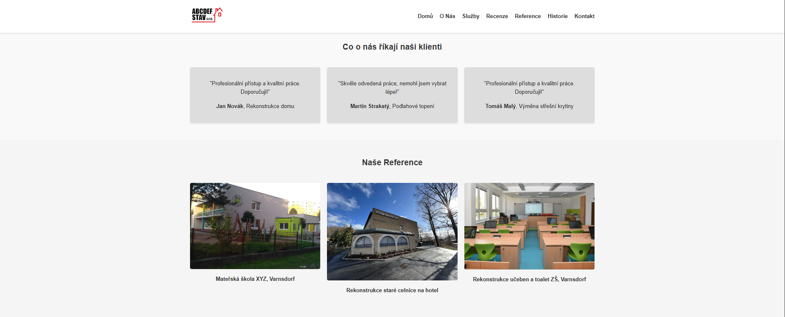
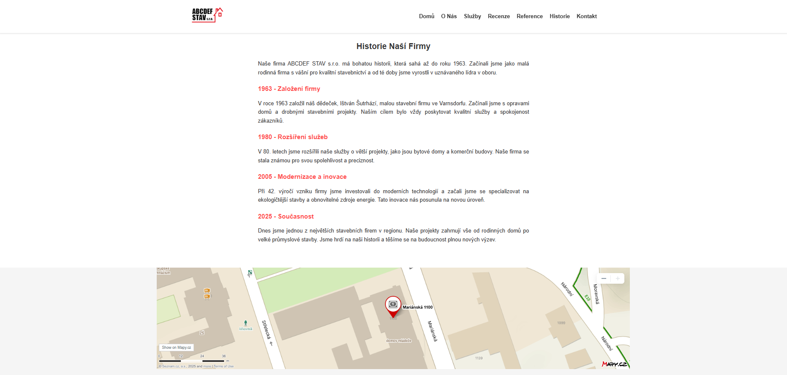
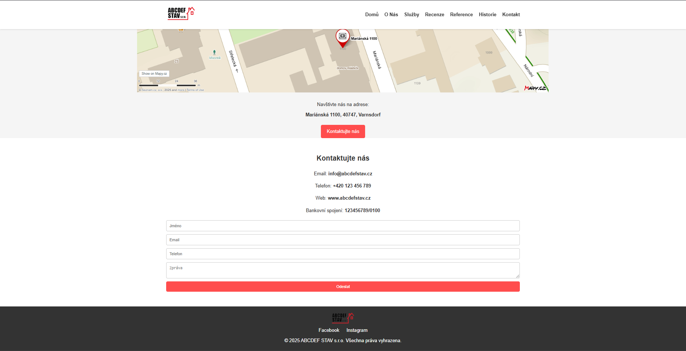

WEB-FIRMA-080225

Pár slov na úvod:

Tento web mi dal dost zabrat a naučil jsem se spoustu nových věcí. K instrukcím zadaným v dokumentu jsem implementoval další funkčnost stránky tak, aby se dala skoro bez úprav normálně používat. S pomocí umělé inteligence se mi podařilo udělat stránku responzivní, například s funkčním hamburgerovým menu, které se automaticky zobrazí při spuštění webu na telefonu. Práce mě hodně bavila a doporučuji si stránku stáhnout a vyzkoušet všechno, co umí, jsem na ní hrdý :D. 

Funkce stránky:
    -responzivnost při zobrazení na různých zařízeních
    -dělení na různé sekce přístupné jak scrollováním, tak i výběrem v navigačním menu
    -funkce zobrazení fiktivní firmy na mapě přímo na stránce(jako místo jsem zadal adresu naší školy):
        
        -mapa je také plně interaktivní
    -základní kontaktní formulář a informace jako email, telefon, atd.

Screenshoty webu při 80% zobrazení:

Videoukázka webu při PC zobrazení:
<video controls src="Web-showcase-pc.mp4" title="PC"></video>

Videoukázka webu při mobilním zobrazení:
<video controls src="Web-showcase-phone.mp4" title="Phone"></video>

**Nepřetáčet videa, z nějakého důvodu se při přetáčení videí stávají grafické glithche**
